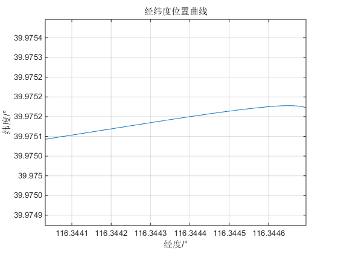
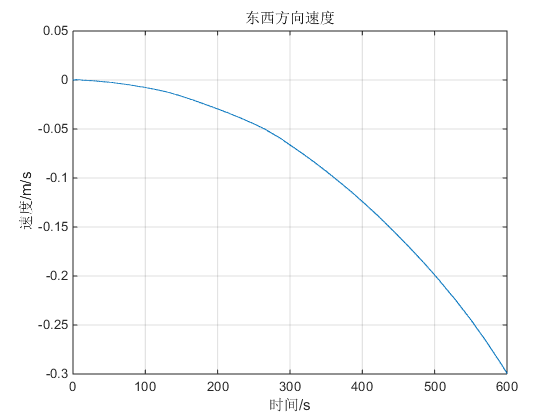
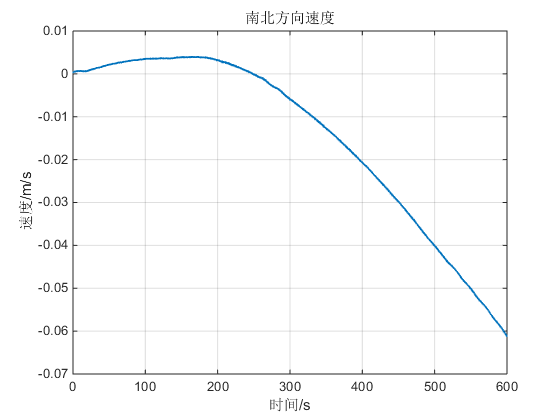
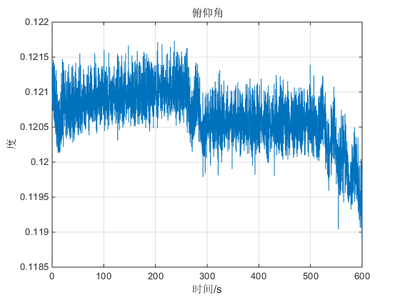
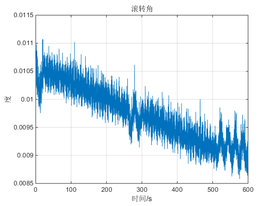
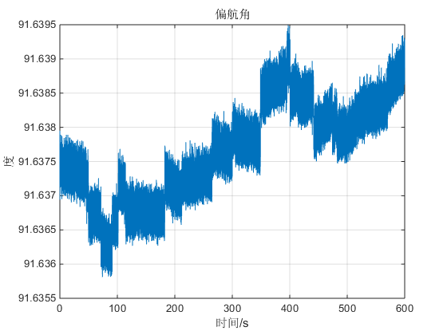

<div class="content">

Contents
--------

<div>

-   [读取数据并存储](#2)
-   [定义初始状态](#3)
-   [其他相关常量](#4)
-   [求解四元数系数q0,q1,q2,q3的初值 偏航逆时针为正](#5)
-   [循环计算导航参数并更新状态](#6)
-   [绘图部分](#7)

</div>

``` {.codeinput}
clc
clear
```

读取数据并存储[]()
------------------

``` {.codeinput}
a=load('jlfw.mat');
Wib_INSc=a.wib_INSc;f_INSc=a.f_INSc;
L(1,:)=zeros(1,48000);
Lambda(1,:)=zeros(1,48000);
Vx(1,:)=zeros(1,48000);
Vy(1,:)=zeros(1,48000);
Vz(1,:)=zeros(1,48000);
Rx(1,:)=zeros(1,48000);                                                     %定义存放卯酉圈曲率半径数据的矩阵
Ry(1,:)=zeros(1,48000);                                                     %定义存放子午圈曲率半径数据的矩阵
psi(1,:)=zeros(1,48000);                                                    %定义存放偏航角数据的矩阵
theta(1,:)=zeros(1,48000);                                                  %定义存放俯仰角数据的矩阵
gamma(1,:)=zeros(1,48000);                                                  %定义存放滚转角数据的矩阵
I=eye(4);                                                                   %定义四阶矩阵用于计算四元数
Wibx(1,:)=Wib_INSc(1,:);                                                    %提取陀螺正东方向角速率并定义
Wiby(1,:)=Wib_INSc(2,:);                                                    %提取陀螺正北方向角速率并定义
Wibz(1,:)=Wib_INSc(3,:);                                                    %提取陀螺天向角速率并定义
fibbx(1,:)=f_INSc(1,:);                                                     %x方向的比力数据
fibby(1,:)=f_INSc(2,:);                                                     %y方向的比力数据
fibbz(1,:)=f_INSc(3,:);                                                     %z方向的比力数据
```

定义初始状态[]()
----------------

``` {.codeinput}
L(1,1)=39.975172/180*pi;                                                    %纬度初始值 单位：弧度
Lambda(1,1)=116.344695283/180*pi;                                           %经度初始值 单位：弧度
Vx(1,1)=0.000048637;                                                        %初始速度x方向分量
Vy(1,1)=0.000206947;                                                        %初始速度y方向分量
Vz(1,1)=0.007106781;                                                        %初始速度z方向分量
psi(1,1)=2*pi-91.637207 /180*pi;                                            %偏航角初始值 单位：弧度
theta(1,1)=0.120992605 /180*pi;                                             %俯仰角初始值 单位：弧度
gamma(1,1)=0.010445947 /180*pi;                                             %滚转角初始值 单位：弧度
```

其他相关常量[]()
----------------

``` {.codeinput}
g0=9.7803267714;
gk1=0.00193185138639;
gk2=0.00669437999013;
Wie=7.292115147e-5;                                                         %地球自转角速度
Re=6378245;                                                                 %长半径
e=1/298.3;                                                                  %椭圆度
t=1/80;                                                                     %采样时间
H=30;                                                                       %高度
```

求解四元数系数q0,q1,q2,q3的初值 偏航逆时针为正[]()
--------------------------------------------------

``` {.codeinput}
q(1,1)=cos(psi(1,1)/2)*cos(theta(1,1)/2)*cos(gamma(1,1)/2)...
      +sin(psi(1,1)/2)*sin(theta(1,1)/2)*sin(gamma(1,1)/2);                 %q0
q(2,1)=cos(psi(1,1)/2)*sin(theta(1,1)/2)*cos(gamma(1,1)/2)...
      +sin(psi(1,1)/2)*cos(theta(1,1)/2)*sin(gamma(1,1)/2);                 %q1
q(3,1)=cos(psi(1,1)/2)*cos(theta(1,1)/2)*sin(gamma(1,1)/2)...
      -sin(psi(1,1)/2)*sin(theta(1,1)/2)*cos(gamma(1,1)/2);                 %q2
q(4,1)=cos(psi(1,1)/2)*sin(theta(1,1)/2)*sin(gamma(1,1)/2)...
      -sin(psi(1,1)/2)*cos(theta(1,1)/2)*cos(gamma(1,1)/2);                 %q3
```

循环计算导航参数并更新状态[]()
------------------------------

``` {.codeinput}
for i=1:48000-1
    g=g0*(1+gk1*sin(L(i)^2)*(1-2*H/Re)/sqrt(1-gk2*sin(L(i)^2)));            %计算重力加速度
    Rx(i)=Re/(1-e*(sin(L(i)))^2);                                           %根据纬度计算卯酉圈曲率半径
    Ry(i)=Re/(1+2*e-3*e*(sin(L(i)))^2);                                     %根据纬度计算子午圈曲率半径
    %求解四元数姿态矩阵
    q0=q(1,i);q1=q(2,i);q2=q(3,i);q3=q(4,i);
    Ctb=[q0^2+q1^2-q2^2-q3^2, 2*(q1*q2+q0*q3), 2*(q1*q3-q0*q2);
        2*(q1*q2-q0*q3),q2^2-q3^2+q0^2-q1^2,2*(q2*q3+q0*q1);
        2*(q1*q3+q0*q2),2*(q2*q3-q0*q1),q3^2-q2^2-q1^2+q0^2;];
    Cbt=Ctb';
    fibt=Cbt*[fibbx(i);fibby(i);fibbz(i)];                                  %比力数据
    fibtx(i)=fibt(1,1);fibty(i)=fibt(2,1);fibtz(i)=fibt(3,1);
    Vx(1,i+1)=(fibtx(i)+(2*Wie*sin(L(i))+Vx(i)*tan(L(i))/Rx(i))*Vy(i)...
             -(2*Wie*cos(L(i))+Vx(i)/Rx(i))*Vz(i))*t+Vx(i);                 %计算速度x方向分量
    Vy(1,i+1)=(fibty(i)-(2*Wie*sin(L(i))+Vx(i)*tan(L(i))/Rx(i))*Vx(i)...
             +Vy(i)*Vz(i)/Ry(i))*t+Vy(i);                                   %计算速度y方向分量
    Vz(1,i+1)=(fibtz(i)+(2*Wie*cos(L(i)+Vx(i))/Rx(i))*Vx(i)...
             +Vy(i)*Vy(i)/Ry(i)-g)*t+Vz(i);                                 %计算速度z方向分量
    Witt=[-Vy(i)/Ry(i);
        Wie*cos(L(i))+Vx(i)/Rx(i);
        Wie*sin(L(i))+Vx(i)*tan(L(i))/Rx(i)];                               %求出平台指令角速度值
    Wibb=[Wibx(i);Wiby(i);Wibz(i)];
    Wtbb=Wibb-Ctb*Witt;                                                     %将指令角速度转换到平台坐标系,并求解Wtbb
    L(1,i+1)=t*Vy(i)/Ry(i)+L(i);
    Lambda(1,i+1)=t*Vx(i)/(Rx(i)*cos(L(i)))+ Lambda(i);
    x=Wtbb(1,1)*t;y=Wtbb(2,1)*t;z=Wtbb(3,1)*t;                              %求取迭代矩阵中的各Δtheta
    A=[0 -x -y -z;x 0 z -y;y -z 0 x;z y -x 0];                              %求取迭代矩阵[Δtheta]
    T=x^2+y^2+z^2;                                                          %计算[Δtheta]^2的
    q(:,i+1)=((1-T/8+T^2/384)*I+(1/2-T/48)*A)*q(:,i);                       %求q
    theta(i+1)=asin(Ctb(2,3));
    %主值判断
    if(Ctb(2,2)>=0)
        if(Ctb(2,1)>=0)
            psi(i+1)=2*pi-(atan(Ctb(2,1)/Ctb(2,2)));
        else
            psi(i+1)=2*pi-(atan(Ctb(2,1)/Ctb(2,2))+2*pi);
        end
    else
        if(Ctb(2,1)>0)
            psi(i+1)=2*pi-(atan(Ctb(2,1)/Ctb(2,2))+pi);
        else
            psi(i+1)=2*pi-(atan(Ctb(2,1)/Ctb(2,2))+pi);
        end
    end
    if(Ctb(3,3)>0)
        gamma(i+1)=atan(-Ctb(1,3)/Ctb(3,3));
    elseif(Ctb(1,3)<0)
        gamma(i+1)=atan(-Ctb(1,3)/Ctb(3,3))+pi;
    else
        gamma(i+1)=atan(-Ctb(1,3)/Ctb(3,3))-pi;
    end
end
psi(1,1)=91.637207 /180*pi;
```

绘图部分[]()
------------

``` {.codeinput}
figure;plot(Lambda*180/pi,L*180/pi);axis equal;
title('经纬度位置曲线');xlabel('经度/°');ylabel('纬度/°');grid on;
t=linspace(0,600-1/80,48000);
figure; plot(t,Vx);title('东西方向速度');xlabel('时间/s');ylabel('速度/m/s');grid on;
figure; plot(t,Vy);title('南北方向速度');xlabel('时间/s');ylabel('速度/m/s');grid on;
figure; plot(t,theta*180/pi);title('俯仰角');xlabel('时间/s');ylabel('度');grid on;
figure; plot(t,gamma*180/pi);title('滚转角');xlabel('时间/s');ylabel('度');grid on;
figure; plot(t,psi*180/pi);title('偏航角');xlabel('时间/s');ylabel('度');grid on;
```

  
  
\
[Published with MATLAB®
R2014b](http://www.mathworks.com/products/matlab/)\

</div>
